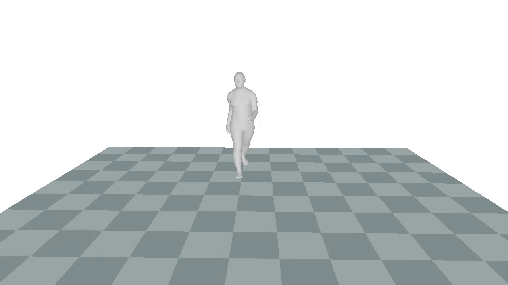
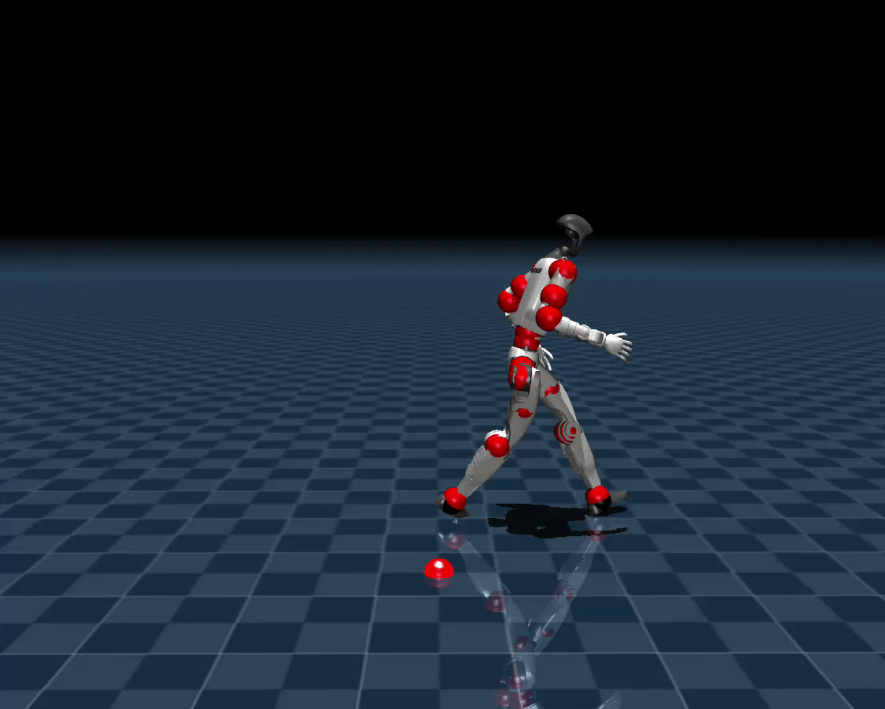
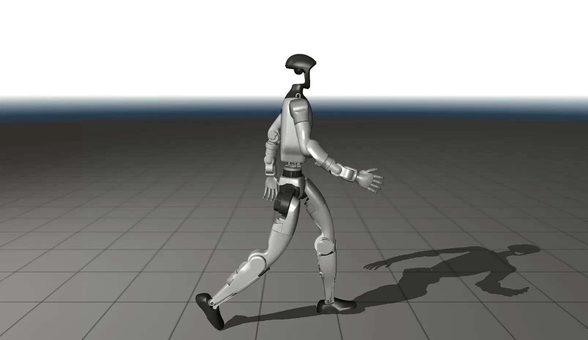
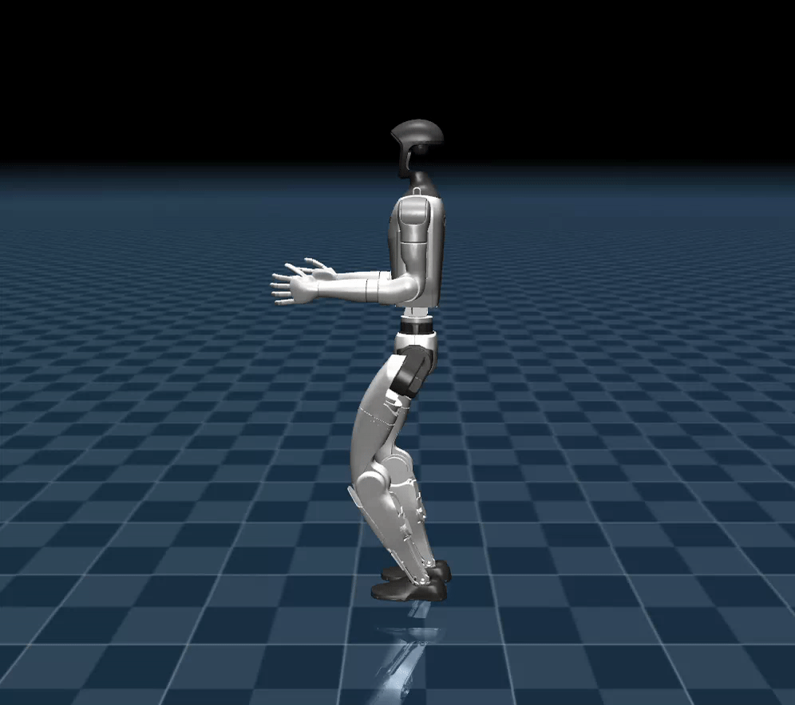
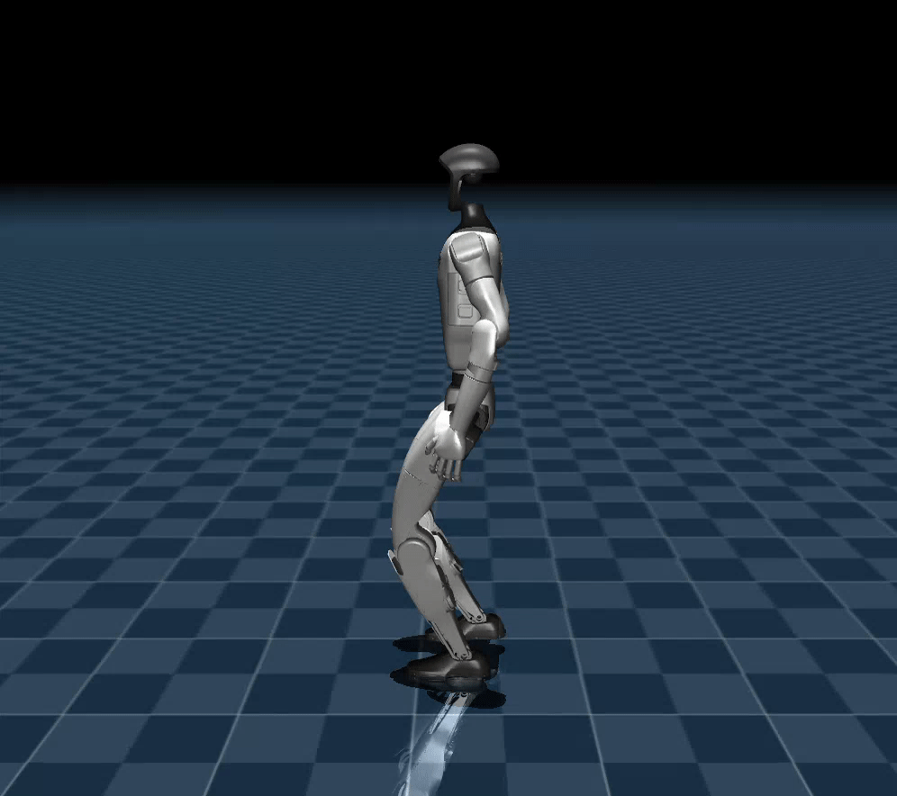
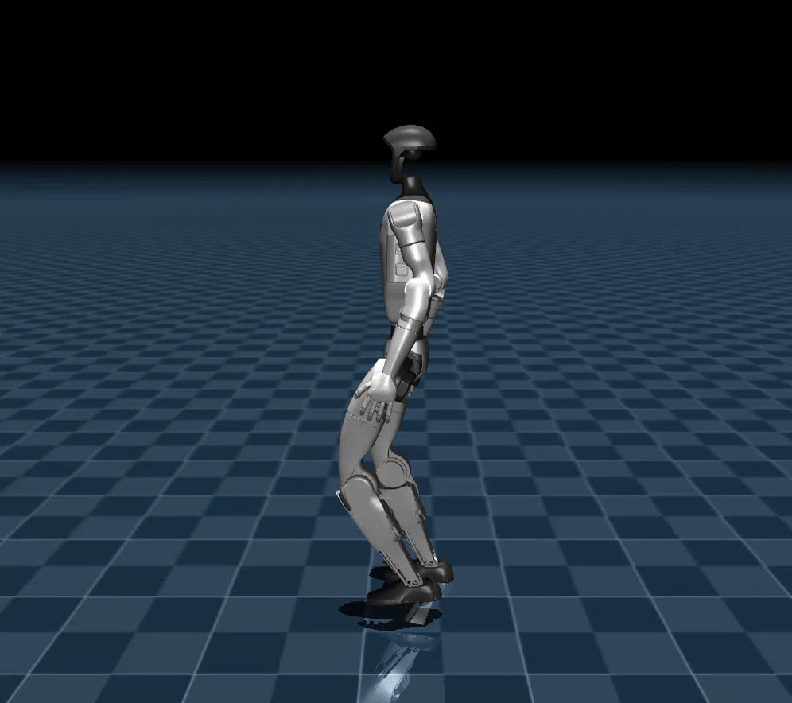
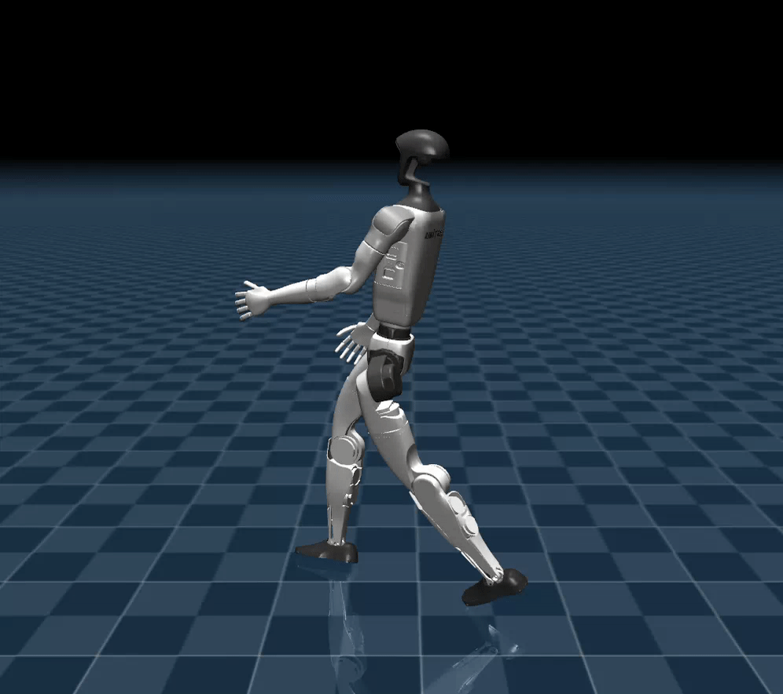

<div align="center">
  <h1 align="center">Unitree RL GYM</h1>
  <p align="center">
    <a href="README.md">🌎 English</a> | <span>🇨🇳 中文</span>
  </p>
</div>

<p align="center">
  🎮🚪 <strong>面向 Unitree Go2、H1、H1_2、G1 的强化学习示例与训练代码。</strong><br/>
  本 fork 的<strong>主线</strong>是使用 <strong>AMP 式判别器塑形</strong> 做 G1 全身行走，使人形步态接近经重定向的人类行走数据；传统的 <strong>PPO 里程计/速度跟踪</strong>（<code>g1</code>、无运动先验的 <code>g1_upper</code> 等）保留为 <strong>baseline</strong>。<strong><code>g1_upper_motion_ref</code></strong>（逐步关节参考追踪塑形）在本仓库中标记为<strong>未走通的尝试</strong>，仅保留可复现入口，<strong>不推荐</strong>作为主要方案。
</p>

## 📦 安装配置

安装和配置步骤请参考 [setup.md](/doc/setup_zh.md)

## 🎯 数据：AMASS 行走子集

专家动作来自 [**AMASS**](https://amass.is.tue.mpg.de/)，需在 [官方下载页注册后获取](https://amass.is.tue.mpg.de/download.php)。本工作流仅使用 **BMLrub**、**CMU**、**KIT** 三个子集（与下文「行走筛选」一致）。分发或发表论文时请遵守 AMASS **许可与引用**要求。

**示例 — CMU Subject 07 SMPL 姿态渲染** · 源文件 [`pics/07_01_poses_render_rot0_15fps.gif`](pics/07_01_poses_render_rot0_15fps.gif)



## 🔄 动作重定向（两条管线）

`g1_upper_amp` / `g1_upper_motion_ref` 使用的专家轨迹需将人体动作重定向到 Unitree G1。我们维护两个关联仓库，并实现**一致的行走子集筛选**（名称规则 + 运动统计），保证训练侧 clip 集合可对齐。

### 1） [SLDRMK/AMASS-POST-PROCESS](https://github.com/SLDRMK/AMASS-POST-PROCESS)

- **Fork 自** [TeleHuman/PBHC](https://github.com/TeleHuman/PBHC)（KungfuBot / PBHC 运动处理链路）。
- **核心代码：** [`smpl_retarget/`](https://github.com/SLDRMK/AMASS-POST-PROCESS/tree/main/smpl_retarget)，基于 [Mink](https://github.com/kevinzakka/mink) 的微分 IK 重定向（`mink_retarget/convert_fit_motion.py`），融合了 MaskedMimic / PHC 思路。
- **本 fork 改进要点（摘要）：** 重写**相对位置** `FrameTask`（在 SMPL 父关节局部帧内取骨方向）；增加 **`TorsoUprightTask`**（约束 pelvis / torso / head 等单位竖直方向，抑制侧倾）；代价权重重调（`ROOT_*`、`RELATIVE_*`、`POSTURE_SCALE`、`TORSO_UPRIGHT_SCALE` 等）。成功重定向后的**整段聚合 pickle** 写入 `smpl_retarget/retargeted_motion_data/mink_adjust/<stem>.pkl`（与 `walking_candidates.jsonl` 中 `mink_aggregate_*` 字段一致）。
- **修改动机：** 原版 PBHC 系 Mink 栈在片面追求全局 SMPL 关键点贴合时，容易出现 **腿型内八（膝/踝内收）**、**躯干佝偻前倾**、**大臂夹着身体摆动不开**等次生姿态；上述相对骨长约束与躯干直立项即针对这些问题补强。

**示例 — Mink IK 重定向（本 fork）** · 源文件 [`pics/mink_retarget_rot0_15fps.gif`](pics/mink_retarget_rot0_15fps.gif)



**行走 / 数据集筛选（`convert_fit_motion.py`，`--filter-walking` / `--filter-only`）：**

- **跳过目录名** 含 `retarget`、`smpl` 或 `h1` 的子目录。
- **扫描** `**/*.npz` 与 `**/*.pkl`；固定跳过 `shape.npz` 与含 `stagei` 等规则见上游 README。
- **名称门控（当前策略启用的数据集）：**
  - **CMU** — 仅被试 **`07`、`08`、`17`、`35`、`39`**；
  - **KIT** — 文件名须含 `walk`；
  - **BMLrub / BioMotionLab_NTroje** — 须匹配 `*_normal_walk*_poses.npz`（不区分大小写的 glob）；
  - 其它数据集目录 → 当前行走策略下**直接拒绝**。
- **运动门控：** 根节点平移平均速度 ∈ **[0.3, 2.0] m/s**（Typer 默认）；对水平向主导位移做 FFT，主频 ∈ **0.4–3.0 Hz** 且谱峰 ≥ 带内中位数的 **3 倍**。

完整说明见：[AMASS-POST-PROCESS `smpl_retarget/README.md`](https://github.com/SLDRMK/AMASS-POST-PROCESS/blob/main/smpl_retarget/README.md)（克隆后本地路径：`AMASS-POST-PROCESS/smpl_retarget/README.md`）。

### 2） [SLDRMK/GMR](https://github.com/SLDRMK/GMR)

- **Fork 自** [YanjieZe/GMR](https://github.com/YanjieZe/GMR)。
- **为何 GMR 往往效果更好（简述）：** GMR 将重定向视作**全身** IK/优化问题，目标与正则（含默认 **关节速度限幅**、防「锁在一侧」的过拟合惩罚等）偏向 **可对 RL 跟踪友好、物理上不过分扭曲**的解，而不是单帧无止境地「硬贴 SMPL」。这在同一套行走筛选数据上，通常能进一步减轻 **内八、含胸夹臂、局部姿态坍缩** 等局部极小。我们经验上 G1 的观感 **更自然、更顺滑**。

**示例 — GMR 重定向** · 源文件 [`pics/gmr_retarget_rot0_15fps.gif`](pics/gmr_retarget_rot0_15fps.gif)



- **批量 SMPL-X → 机器人：** `scripts/smplx_to_robot_dataset.py`，加 **`--filter_walking`**，`--src_folder` 指向 AMASS 式根目录（其下含 **`CMU/`**、**`KIT/`**、**`BMLrub/`** 等）。
- **名称筛选（与 `convert_fit_motion.py` 的设计意图对齐）：**

| 数据集目录 | 规则 |
|-----------|------|
| **CMU** | 被试 **07, 08, 17, 35, 39** |
| **BMLrub** / BioMotionLab_NTroje | `*_normal_walk*_poses.npz` 或 `*_normal_walk*_stageii.npz` |
| **KIT**（目录名含 `kit`） | 文件名须含 `walk` |

- **运动门控：** 通过名称筛选后，速度与 FFT 周期性与上表 AMASS-POST-PROCESS 一致（默认 **0.3–2.0 m/s**，**0.4–3 Hz**，峰/中位 ≥ **3**）。

- **额外批量排除（与该 fork 脚本内恒开逻辑一致）：** `assets/hard_motions/*.txt` 列出的难例 basename，或文件名子串含 `BMLrub`、`EKUT`、`crawl`、`_lie`、`upstairs`、`downstairs` 等，在批量处理前移除。

详见：[GMR README — SMPL-X 重定向与 `--filter_walking`](https://github.com/SLDRMK/GMR/blob/main/README.md)。

将本仓库训练/Play 所用的 **`MOTION_REF_DATA_DIR`** 指到包含重定向 **`*.pkl`** 的目录（需满足 [`legged_gym.utils.mink_reference_motion`](legged_gym/utils/mink_reference_motion.py) 的扫描约定）。

## 🔁 流程说明

强化学习实现运动控制的基本流程为：

`Train` → `Play` → `Sim2Sim` → `Sim2Real`

- **Train**: 通过 Gym 仿真环境，让机器人与环境互动，找到最满足奖励设计的策略。通常不推荐实时查看效果，以免降低训练效率。
- **Play**: 通过 Play 命令查看训练后的策略效果，确保策略符合预期。
- **Sim2Sim**: 将 Gym 训练完成的策略部署到其他仿真器，避免策略小众于 Gym 特性。
- **Sim2Real**: 将策略部署到实物机器人，实现运动控制。

若目标是 **类人行走步态**：数据与重定向见上文章节，训练主推 **`g1_upper_amp`**；传统 **`g1` / `g1_upper`** 仍可作为**无运动先验**对照 baseline。

## 🛠️ 使用指南

### 1. 训练

```bash
python legged_gym/scripts/train.py --task=xxx
```

#### ⚙️ 常用命令行参数

| 类别 | 说明 |
|------|------|
| 任务 | **`--task`**：如 `go2`、`g1`、`h1`、`h1_2`；本文 G1 **23DoF**：**`g1_upper_amp`**（判别器 AMP 模仿，**主推**）、**`g1_upper`**（分阶段 PPO baseline）、**`g1_upper_motion_ref`**（逐步参考塑形，遗留、不推荐）。 |
| 并行与设备 | **`--headless`**、**`--num_envs`**、**`--sim_device`**、**`--rl_device`**、**`--seed`** |
| 停止条件 | **`--train_to_iteration`**：训练到全局 `learning_iteration` 目标（本次运行步数 **≈** **`目标 − checkpoint.restored_iter`**）。未指定而仅用 **`--max_iterations`**（覆盖配置里的 **`runner.max_iterations`**）时，该整数表示 **本进程**里传给 **`learn(num_learning_iterations)`** 的次数：会**在原 `iter` 上累加**，续跑时注意不是「冲到固定总 iter」除非你自行换算。|
| Checkpoint | **`--resume`** / **`--load_run`** / **`--checkpoint`**：凡走加载链路都会恢复**权重与** `current_learning_iteration`（**λ<sub>amp</sub>（AMP）课程依赖 `iter`**，勿混用期望值） |
| G1 分阶段 | **`--training_stage`**：`upper_body` \| `joint_finetune`；**`--lower_body_checkpoint`** 仅 **`upper_body`**：`g1` 的 **`model_*.pt`**（**不要**填导出的 TorchScript） |
| 日志目录 | **`--resume_fork`**：续跑时将 TB/权重写入**新时间戳目录**（与单次把配置里 **`runner.resume_continue_logdir=False`** 等效）；**`resume_continue_logdir` 不负责「要不要加载」，只决定是否沿用 checkpoint 原有 run 文件夹** |

**默认保存**：**`logs/<experiment_name>/<date_time>_<run_name>/model_<iteration>.pt`**；AMP 权重另含判别器 **`discriminator_state_dict`**（及判别器优化器状态）。

---

#### G1 分阶段训练（无 AMP — baseline PPO）

- **`g1`**：12DoF 下半身。
- **`g1_upper + upper_body`**：下肢由 **`g1` checkpoint** 固定，上肢策略学习。
- **`g1_upper + joint_finetune`**：23DoF 全身微调/联合训练。

上半身阶段示例：

```bash
bash legged_gym/scripts/train_g1_upper_stage2.sh
```

也可指定下半身权重：

```bash
LOWER_BODY_CHECKPOINT=logs/g1/Apr13_07-17-29_/model_10000.pt \
NUM_ENVS=4096 MAX_ITERATIONS=10000 RUN_NAME=stage2_upper_stable \
bash legged_gym/scripts/train_g1_upper_stage2.sh
```

全身 **`joint_finetune`**：

```bash
bash legged_gym/scripts/train_g1_fullbody_isaaclab.sh
```

（使用 `g1_upper` + `joint_finetune`，不加载下半身 checkpoint。）该类 baseline 可走随机 reset、摩擦/质量/`push`、`init_noise_std=0.8` 等与原版 legged gym 对齐的随机化。**类人步态首推下列 AMP 档位。**

---

#### G1：参考轨迹逐步塑形（遗留，不推荐）

可选 **`g1_upper_motion_ref`**：稠密 **`motion_ref_dof`** 逐步贴参考。在本项目设定下**明显不如 `g1_upper_amp`**，仅保留复现。日志：**`logs/g1_upper_motion_ref/`**。

```bash
export MOTION_REF_DATA_DIR=/path/to/mink_or_gmr_pickles   # 递归匹配 `motion_ref.glob_pattern`
bash legged_gym/scripts/train_g1_upper_motion_ref.sh
```

若配置里 **`motion_ref.data_dir`** 为空，必须设置 **`MOTION_REF_DATA_DIR`**，否则环境初始化报错。

**调参**（[`g1_config.py`](legged_gym/envs/g1/g1_config.py) `G1UpperBodyMotionRefCfg`）：**`motion_ref_dof`**、**`motion_ref.err_reduce`**、**`command_gate`**、**σ 为关节误差向量 L2 范数尺度（rad），课程 `σ ← max(σ_min, min(batch 均值‖q−q_ref‖₂, σ))`，奖励 `exp(−mse/σ²)`**、**`curriculum_norm_ema_alpha`** 等。

---

#### G1：AMP 判别器模仿（**推荐主线**）

任务 **`g1_upper_amp`**：用**二分类判别器**在短**多帧**窗口上读取**关节角度 q、角速度 q_dot**（相对默认站立、与 env 观测同尺度），在 PPO 回报上叠加 **λ<sub>amp</sub> · r_amp**，其中 **`r_amp = −log(clamp(1 − sigmoid(D(x)), eps))`**。**`motion_ref_dof = 0`**，**无**逐步关节追踪奖励。

实验目录：**`logs/g1_upper_amp/`**。

##### 快速启动

```bash
# 仓库脚本里的示例默认：仅 CMU 筛选后的 GMR 输出（请改成你的路径）
export MOTION_REF_DATA_DIR=/path/to/your_pickles
bash legged_gym/scripts/train_g1_upper_amp.sh
```

等价：`python legged_gym/scripts/train.py --task=g1_upper_amp --training_stage=joint_finetune ...`。可用环境变量 **`NUM_ENVS`**、**`MAX_ITERATIONS`**、**`RUN_NAME`** 等（见 [`train_g1_upper_amp.sh`](legged_gym/scripts/train_g1_upper_amp.sh)）。

##### 专家数据与经验结论

- **配置入口**：**`MOTION_REF_DATA_DIR`**（或填 **`motion_ref.data_dir`**），目录下递归匹配 **`motion_ref.glob_pattern`**（默认 **`*.pkl`**），见 [`build_mink_motion_bank`](legged_gym/utils/mink_reference_motion.py)。

- **三库混训问题**：曾将 **CMU + BMLrub + KIT** 行走数据**同时**放入同一专家库；在**单一全局判别器**下不同来源的步态/风格**分布差异大**，训练侧出现**风格冲突**、难以稳定对齐。最终方案改为**仅使用经行走筛选的 CMU 子集**（被试规则与上文 **「数据 / 重定向」** 一致）。**`train_g1_upper_amp.sh` 中的默认路径**演示的是 **CMU 子集目录结构**，实际部署请指向你自己导出的 pickle 根目录。

##### 专家采样（判别器更新时）

| 机制 | 实现 / 配置项 |
|------|----------------|
| 抽哪条 clip | **`MinkReferenceMotionBank.sample_clip_indices`**：**均匀随机** clip 下标。可用 **`motion_ref.clip_limit`** 截断「排序后路径列表」的前若干条（见 `build_mink_motion_bank`）。 |
| clip 内相位 | **`sample_phase_times`**：在单条 clip 时长内**连续均匀**随机起点；按 **`policy_dt`** 线性插值、循环播放。 |

##### λ<sub>amp</sub> 课程（模仿项介入节奏）

由 **`G1UpperBodyAmpCfg.amp`** 控制。默认 **`curriculum_enabled = True`**、**`curriculum_interp_between_milestones = False`** → **λ<sub>amp</sub> 为阶梯常数**（里程碑之间**不**线性插值）。

| 里程碑（`learning_iteration` ≥） | λ<sub>amp</sub> |
|:---:|:---:|
| 0 | 0.000 |
| 2000 | 0.035 |
| 6000 | 0.070 |
| 12000 | 0.100 |
| 18000 | 0.150 |

**`λ = 0`** 阶段：因 **`min_scale_for_amp_disc = 0.0`**，**不跑判别器前向与反传**（纯 PPO 行走）。若 **`curriculum_enabled = False`**，则使用常数 **`reward_scale = 0.25`**。

训练器默认 **`G1UpperBodyAmpCfgPPO.runner.max_iterations = 25000`**（可用 **`--max_iterations`** 覆盖）；自迭代 **≥18000** 起 **λ<sub>amp</sub>** 保持 **0.15** 直至结束（除非改课程或拉长 run）。

##### 判别器结构与学习率

为缓解 **D 过快过拟合 / 训练不稳**，本仓库相对「宽 MLP」默认做了**降维、降学习率**等调整（数值见配置注释中的旧默认对照）。

| 项 | 本仓库默认 | 说明 |
|----|------------|------|
| **`hidden_dims`** | **`[128, 128]`** | 注释中保留旧值 **`[512, 256]`** 供对照 |
| **`activation`** | `elu` | |
| **`disc_learning_rate`** | **`1e-5`** | 注释中旧值 **`3e-4`** |
| **`label_smoothing`** | **`0.1`** | BCE 目标：假样本 → **`ls`**，专家 → **`1−ls`** |
| **`num_updates_per_iteration`** | **`1`** | 每轮 PPO 迭代内按 **`disc_minibatches`** 完整训练若干 pass |
| **`disc_minibatches`** | `4` | |
| **`disc_grad_norm`** | `1.0` | 梯度裁剪 |
| **`disc_weight_decay`** | `0` | |

##### 其它稳定化默认

| 项 | 默认 |
|----|------|
| **`disc_stop_train_accuracy_above`** | **`0.85`** — 单 minibatch **平衡**硬分类准确率过高则**跳过**该 batch 的 D 更新 |
| **`fake_amp_pool_capacity_rows`** | **`-1`** — 自动容量 **max(8192, 8×steps×envs)** |
| **`fake_pool_overflow_resample`** / **`fake_pool_mix_fraction`** | **`True`** / **`0.5`** — 负样本混合 **历史池** 与 **当前 rollout** |
| **`train_feature_mask_prob`** | **`0.1`** — 仅 **训练**时对判别器输入做特征维随机 mask |
| 时序堆叠 | **`history_frames = 10`**、**`history_window_s = 0.9`** — 在 **`history_window_s`** 秒窗内**均匀**取 **10** 帧拼成 `D` 的输入（见 **`gather_amp_dof_features`**） |

##### 日志与复现

- TensorBoard：**`AMP/lambda_amp`**、**`AMP/mean_step_amp_scaled`**、判别器准确率/跳过次数、**`Timing/learn_disc_amp`** 等。  
- **续跑**：恢复的 **`iter`** 与上表里程碑应对齐；需要「跑到固定全局 iter」时用 **`--train_to_iteration`** 或调整 **`reward_scale_schedule_iters`**，避免与 checkpoint 计数脱节。

_以上默认均对应 [`legged_gym/envs/g1/g1_config.py`](legged_gym/envs/g1/g1_config.py) 中 **`G1UpperBodyAmpCfg`** / **`G1UpperBodyAmpCfgPPO`**。_

### 2. Play

如果想要在 Gym 中查看训练效果，可以运行以下命令：

```bash
python legged_gym/scripts/play.py --task=xxx
```

**说明**：

- Play 启动参数与 Train 相同。
- 默认加载实验文件夹上次运行的最后一个模型。
- 可通过 `load_run` 和 `checkpoint` 指定其他模型。

#### 💾 导出网络

Play 会导出 Actor 网络，保存到当前加载 checkpoint 所在的 run 目录中。例如加载
`logs/g1_upper/May02_11-49-20_stage2_upper_stable/model_10000.pt` 时，会导出到
`logs/g1_upper/May02_11-49-20_stage2_upper_stable/`：
- 普通网络（MLP）导出为 `policy_1.pt`
- RNN 网络，导出为 `policy_lstm_1.pt`

导出 G1 12DoF 下半身策略：

```bash
python legged_gym/scripts/play.py \
  --task=g1 \
  --load_run=Apr13_07-17-29_ \
  --checkpoint=10000
```

导出 G1 23DoF 上半身/组合策略：

```bash
python legged_gym/scripts/play.py \
  --task=g1_upper \
  --training_stage=upper_body \
  --lower_body_checkpoint=logs/g1/Apr13_07-17-29_/model_10000.pt \
  --load_run=May02_11-49-20_stage2_upper_stable \
  --checkpoint=10000
```

上述 `upper_body` 组合 Play 时：`lower_body_checkpoint` 必须使用训练 checkpoint（`model_*.pt`），不要使用导出的 TorchScript 文件（`policy_lstm_1.pt`）。

导出 G1 23DoF 全身策略：

```bash
python legged_gym/scripts/play.py \
  --task=g1_upper \
  --training_stage=joint_finetune \
  --load_run=May02_11-49-23_fullbody_isaaclab_randomized \
  --checkpoint=10000
```

**G1 参考运动策略**（`g1_upper_motion_ref`）：与训练时相同，需设置 **`MOTION_REF_DATA_DIR`** 指向 mink pickle 目录，否则无法创建环境。需要图形界面时不要加 `--headless`。

```bash
export MOTION_REF_DATA_DIR=/path/to/mink/pickles

python legged_gym/scripts/play.py \
  --task=g1_upper_motion_ref \
  --training_stage=joint_finetune \
  --load_run=May13_12-16-09_g1_upper_motion_ref_mink
```

可选：`--checkpoint=8000`，或 `--checkpoint=logs/g1_upper_motion_ref/May13_12-16-09_g1_upper_motion_ref_mink/model_8000.pt` 指定权重；默认加载该 run 下最新的 `model_*.pt`。

**G1 AMP 策略**（`g1_upper_amp`）：与训练一致，需设置 **`MOTION_REF_DATA_DIR`** 以初始化动作库。**Play / 导出策略**时使用 Actor-Critic；若 checkpoint 中带判别器权重，`make_alg_runner` 仍会按任务配置拉起对应 Runner。

```bash
export MOTION_REF_DATA_DIR=/path/to/mink/pickles

python legged_gym/scripts/play.py \
  --task=g1_upper_amp \
  --training_stage=joint_finetune \
  --load_run=<你的_amp_run_目录名>
```

可选：`--checkpoint` 填迭代序号或 **`logs/g1_upper_amp/<date>_<run_name>/model_*.pt`** 完整路径。

### 3. Sim2Sim (Mujoco)

支持在 Mujoco 仿真器中运行 Sim2Sim：

```bash
python deploy/deploy_mujoco/deploy_mujoco.py {config_name}
```

#### 参数说明
- `config_name`: 配置文件，默认查询路径为 `deploy/deploy_mujoco/configs/`

#### 示例：运行 G1

```bash
python deploy/deploy_mujoco/deploy_mujoco.py g1.yaml
```

#### ➡️  替换网络模型

默认模型位于 `deploy/pre_train/{robot}/motion.pt`；自己训练的模型需要先通过 Play 导出为 TorchScript，再替换 yaml 配置文件中的 `policy_path`。

G1 Mujoco 目前提供三种配置：

```bash
# 12DoF 下半身单策略
python deploy/deploy_mujoco/deploy_mujoco.py g1.yaml

# 23DoF 全身单策略
python deploy/deploy_mujoco/deploy_mujoco.py g1_23dof.yaml

# 12DoF 下半身策略 + 23DoF 上半身/全身策略组合推理
python deploy/deploy_mujoco/deploy_mujoco.py g1_upper_composite.yaml
```

对应配置文件：

- `deploy/deploy_mujoco/configs/g1.yaml`: 使用 `logs/g1/<run>/policy_lstm_1.pt`
- `deploy/deploy_mujoco/configs/g1_23dof.yaml`: 使用 `logs/g1_upper/<run>/policy_1.pt`
- `deploy/deploy_mujoco/configs/g1_upper_composite.yaml`: 同时配置 `policy_path` 和 `lower_body_policy_path`

组合推理时：

- `lower_body_policy_path` 控制前 12 个下半身关节。
- `policy_path` 可以是 23DoF 策略，部署脚本会自动取上半身部分；也可以是只输出上半身动作的策略。
- `upper_body_action_scale` 用于缩放上半身动作幅度。
- `clip_actions` 用于部署时裁剪策略输出动作，默认配置为 `1.0`，可避免 MuJoCo 中过大的未约束动作造成瞬间失稳。

#### MuJoCo 中 Play 效果（GIF）

以下为本仓库记录的 **MuJoCo `deploy_mujoco` 侧视 / 环绕** 观感（文件名 `*_rot0_15fps.gif`）；与 Isaac 训练任务的大致对应关系如下（具体 `policy_path` 以 yaml 为准）：

1. **Benchmark：下半身 12DoF（`g1`）** — 配置入口 [`deploy/deploy_mujoco/configs/g1.yaml`](deploy/deploy_mujoco/configs/g1.yaml) · [`pics/g1_rot0_15fps.gif`](pics/g1_rot0_15fps.gif)



2. **冻结下半身策略，上半身单独训练后与下肢组合推理（`upper_body` + composite）** — [`g1_upper_composite.yaml`](deploy/deploy_mujoco/configs/g1_upper_composite.yaml) · [`pics/g1_upper_composite_rot0_15fps.gif`](pics/g1_upper_composite_rot0_15fps.gif)



3. **全身训练，对手臂摆动施加强约束（`g1_upper`，`joint_finetune`，单策略 23DoF）** — [`g1_23dof.yaml`](deploy/deploy_mujoco/configs/g1_23dof.yaml) · [`pics/g1_fullbody_rot0_15fps.gif`](pics/g1_fullbody_rot0_15fps.gif)


4. **参考运动塑形（`g1_upper_motion_ref`）** — [`pics/g1_motion_ref_rot0_15fps.gif`](pics/g1_motion_ref_rot0_15fps.gif)



5. **AMP 判别器模仿（`g1_upper_amp`，推荐主线）** — [`pics/g1_amp_rot0_15fps.gif`](pics/g1_amp_rot0_15fps.gif)



#### 可视化相机（可选）

被动查看器可选用 **MjCAMERA_TRACKING** 锁定在机身侧向：球坐标在给定 body 坐标系内，随机器人平移和偏航一起动。示例：

```bash
python deploy/deploy_mujoco/deploy_mujoco.py g1.yaml \
  --camera-follow-side right \
  --camera-follow-distance 2.8 \
  --camera-track-body pelvis
```

参数：**`--camera-follow-side`** `none|right|left`，**`--camera-follow-distance`**，**`--camera-track-body`**（MJCF 中 `<body name=...>`，默认 `pelvis`），**`--camera-follow-elevation`**，可选 **`--camera-follow-azimuth`** 校正左右观感。

### 4. Sim2Real (实物部署)

实现实物部署前，确保机器人进入调试模式。详细步骤请参考 [实物部署指南](deploy/deploy_real/README.zh.md)：

```bash
python deploy/deploy_real/deploy_real.py {net_interface} {config_name}
```

#### 参数说明
- `net_interface`: 连接机器人网卡名称，如 `enp3s0`
- `config_name`: 配置文件，存在于 `deploy/deploy_real/configs/`，如 `g1.yaml`，`h1.yaml`，`h1_2.yaml`

---

## 🎉  致谢

本仓库开发离不开以下开源项目的支持与贡献，特此感谢：

- [legged\_gym](https://github.com/leggedrobotics/legged_gym): 构建训练与运行代码的基础。
- [PBHC](https://github.com/TeleHuman/PBHC) / [AMASS-POST-PROCESS fork](https://github.com/SLDRMK/AMASS-POST-PROCESS): Mink SMPL→机器人重定向管线。
- [GMR](https://github.com/YanjieZe/GMR) / [SLDRMK fork](https://github.com/SLDRMK/GMR): 另一套 SMPL-X 批量重定向与行走筛选。
- [AMASS](https://amass.is.tue.mpg.de/): 人体动作数据（本工作流使用 BMLrub / CMU / KIT 子集）。
- [rsl\_rl](https://github.com/leggedrobotics/rsl_rl.git): 强化学习算法实现。
- [mujoco](https://github.com/google-deepmind/mujoco.git): 提供强大仿真功能。
- [unitree\_sdk2\_python](https://github.com/unitreerobotics/unitree_sdk2_python.git): 实物部署硬件通信接口。


---

## 🔖  许可证

本项目根据 [BSD 3-Clause License](./LICENSE) 授权：
1. 必须保留原始版权声明。
2. 禁止以项目名或组织名作举。
3. 声明所有修改内容。

详情请阅读完整 [LICENSE 文件](./LICENSE)。

